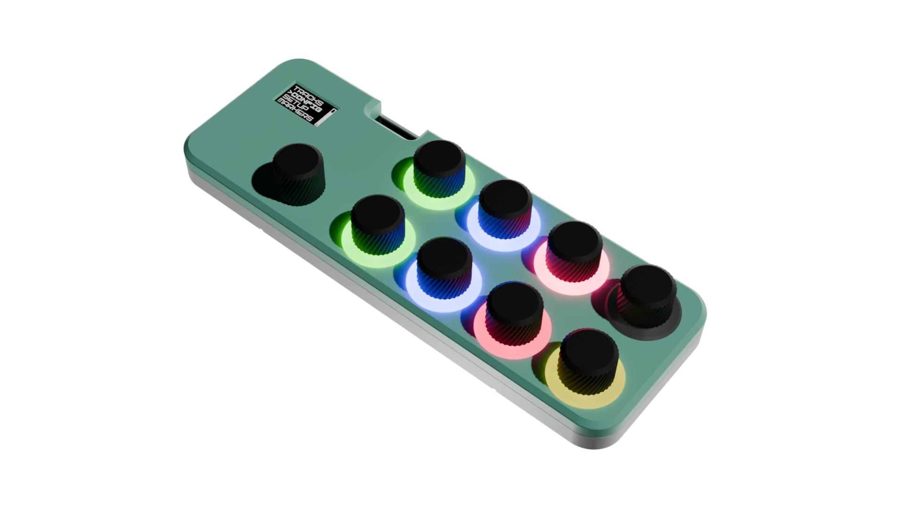

# Sevenist Controller



A 64-track MIDI CC control surface built on an ESP32-S3.

> **Status: mid-rework.**


## What it is

- 8 physical endless-rotation potentiometer modules, paired into 4 
  **tracks**.
- Multiple **track** types :
  - **DUAL** - two independent MIDI CC list outputs, one per knob.
  - **LFO** - a CCs output driven by a waveform (sine/triangle/square/saw),
    clock-synced or free-running.
  - **STEPSEQ** - a 64max-step note sequencer.
  - **MOTIONSEQ** - a 64max-step CC/parameter sequencer.
- Config via a rotary encoder + button on a 128×64 OLED screen.
- 8 addressable RGB LEDs to give per-track visual feedback.
- 16 preset slots
- MIDI I/O over Type-A 3.5mm Jack and USB.

## Hardware

Dev Board: [ESP32-S3 Zero by Waveshare](https://docs.waveshare.com/ESP32-S3-Zero), 4MB flash. Pin/hardware constants
live in [include/boardConfig.h](include/boardConfig.h).
\+ Custom PCB (see [VTM Hardware repository](https://github.com/sevenist/SevenistController-VTM-Hardware) to order on JLCPCB, PCBWay or other fab)

| Signal | Pin | Notes |
| --- | --- | --- |
| Mux select S1/S2/S3 | GPIO9 / GPIO8 / GPIO7 | Dual 3-bit mux addressing |
| ADC1 / ADC2 | GPIO11 / GPIO10 | Mux common/output lines |
| MIDI TX / RX | GPIO43 / GPIO44 | 5-pin DIN MIDI, UART |
| OLED SCK / SDA | GPIO2 / GPIO3 | I2C, SSD1306 128×64 (U8g2) |
| WS2812 data | GPIO1 | 8 LEDs (FastLED) |
| Encoder A / B / switch | GPIO4 / GPIO5 / GPIO6 |  |

The 8 pots are endless-rotation potentiometers, each outputs a sin/cos-like analog
pair decoded into an accumulated position by `Quadrature`
(`src/driver/quadrature.h`/`.cpp`).

## Building

PlatformIO / Arduino framework project [platformio.ini](platformio.ini).

```
pio run                 # build
pio run --target upload # flash
pio device monitor      # serial monitor (115200 baud)
```

Dependencies (pulled automatically by PlatformIO):

- [FastLED](https://github.com/FastLED/FastLED) - LED strip driver
- [U8g2](https://github.com/olikraus/u8g2) - OLED display driver
- [MIDI Library](https://github.com/FortySevenEffects/arduino_midi_library) - MIDI lib

## Project layout

```
src/
  app/          App.h/.cpp - hardware singletons + app-layer state (tracks,
                cursor, menu, mode);
  driver/       Low-level hardware/transport drivers: mux, quadrature,
                MIDI (UART + USB), LittleFS preset persistence.
  Components/   Menu system (Menu.h/.cpp, menus.cpp), Track class hierarchy
                (track.h + one .cpp per ControlType), FreeRTOS task bodies
                (Tasks.h/.cpp), QC widget system (GUIWidgets.h/.cpp).
include/
  boardConfig.h Pin assignments, hardware constants, track-list capacity.
```
